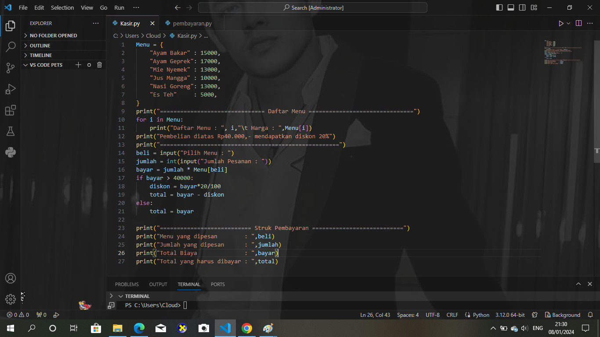
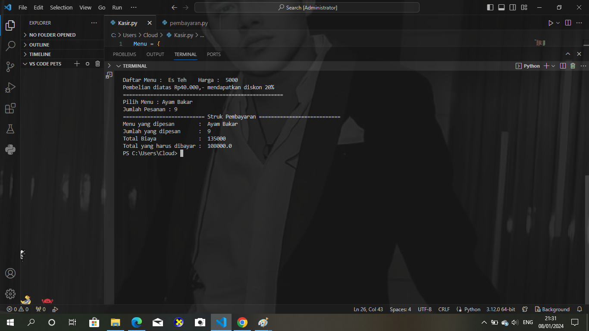

Nama           : Dita Aulia

Kelas          : TI.23.A.6

NIM            : 312310649

Link Project   : https://youtu.be/wbg8OVDgm1I

# CARA KERJA PROGRAM

Buatlah program kasir di sebuah kantin , dengan kondisi berikut:

• List opsi pilihan makanan/minuman dan aksi, bisa menggunakan format dictionary

• Program harus meminta input pilihan makanan dari pengguna.

• Program harus menghitung total harga makanan yang dipesan.

• Program harus menampilkan struk pembelian

